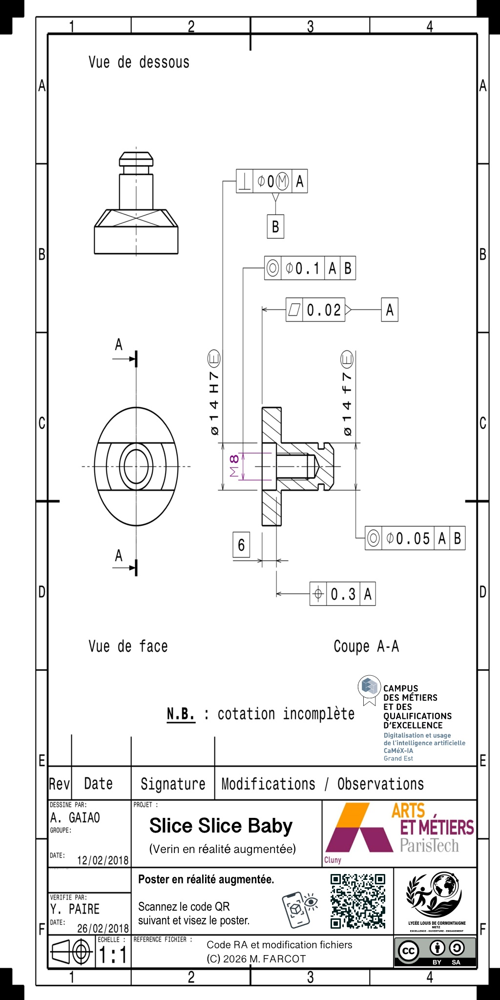

# Slice - Expérience en Réalité Augmentée

Experience en réalité augmentée interactive basée sur la reconnaissance d'image.

> *Projet imaginé, encadré et co-développé par Matthieu Farcot*  
> © 2026 Lycée Louis de Cormontaigne -- Metz

## À propos du projet

**Slice** est une application de réalité augmentée accessible via navigateur web qui permet de visualiser une coupe transversale animée d'un composant mécanique en 3D. En scannant une image cible, l'utilisateur découvre des modèles 3D interactifs avec animations fluides.



## Caractéristiques principales

-  **Reconnaissance d'image** : Détection automatique et robuste de la cible AR via MindAR
-  **Visualisation 3D** : Affichage de modèles GLTF en réalité augmentée directement sur la cible
-  **Animation mécanique** : Piston animé avec mouvement réaliste et boucle infinie
-  **Compatible mobile** : Fonctionne sur iOS, Android et ordinateurs
-  **Accès web** : Aucune installation requise, fonctionnement directement depuis un navigateur

## Technologies utilisées

### 1. A-Frame (v1.6.0)
Framework WebGL/WebVR pour la création de scènes 3D et AR en HTML.
- **Utilisation** : Scène AR, caméra, entités 3D, gestion des assets
- **CDN** : https://aframe.io/releases/1.6.0/aframe.min.js

### 2. MindAR (v1.2.5)
Bibliothèque de reconnaissance d'images pour la réalité augmentée.
- **Utilisation** : Détection de l'image cible, suivi spatial, affichage des objets 3D
- **CDN** : https://cdn.jsdelivr.net/npm/mind-ar@1.2.5/dist/mindar-image-aframe.prod.js

### 3. HTML5 / CSS
Structure et mise en page responsive compatible avec tous les appareils.

## Structure du projet

```
slice/
├── index.html              # Fichier principal de l'application
└── ressources/
    ├── slice.mind          # Fichier de reconnaissance MindAR
    ├── slice.jpg           # Image cible pour détecter l'AR
    └── piston.glb          # Modèle 3D du piston
```

## Installation et utilisation

### Prérequis

- Navigateur web moderne supportant WebGL (Chrome, Firefox, Edge, Safari)
- Caméra fonctionnelle (ordinateur, smartphone, tablette)
- Accès à Internet pour charger les CDN

### Démarrage

1. **Clonez le repository** :
```bash
git clone https://github.com/matthieu-farcot/slice.git
cd slice
```

2. **Ouvrez dans un navigateur** :
   - Directement : ouvrir `index.html` dans votre navigateur
   - Ou via un serveur local (recommandé pour une meilleure stabilité)

3. **Lancez l'expérience** :
   - Pointez votre caméra vers l'image cible (`slice.jpg`)
   - Visualisez la coupe 3D animée en réalité augmentée

## Fonctionnement technique

### Scène AR
L'application crée une scène A-Frame avec suivi d'image MindAR qui :
- Détecte l'image cible en temps réel
- Ancre les éléments 3D sur la cible détectée
- Affiche les objets 3D positionnés correctement

### Éléments affichés
- **Image de référence** : Coupe du composant avec transparence (opacité 70%)
- **Piston principal** : Modèle GLTF animé avec mouvement vertical
- **Vérins** : Deux modèles miroir avec animation de rotation

### Animations
- **Piston** : Animation linéaire de 2 secondes, boucle alternative (haut/bas)
- **Vérins** : Rotation coordonnée avec le piston

## Configuration personnalisée

Vous pouvez ajuster les paramètres AR dans le composant `mindar-image` :

```html
mindar-image="imageTargetSrc: ./ressources/slice.mind; 
              filterMinCF:10000000; 
              filterBeta:1000; 
              warmupTolerance:0; 
              missTolerance:500;"
```

## Compatibilité

| Plateforme | Navigateur | Support |
|-----------|-----------|---------|
| Android | Chrome | Excellent |
| All | Brave | Exceptionnel |
| iOS | Safari 14+ | Wow |
| Desktop | Firefox | Miam |
| Desktop | Edge | Lol. Qui utilise Edge? |

**Note** : Pour iOS, utilisez Safari et activez le mode "playsinline" pour les vidéos.

## Crédits et sources

- Source poster : Camexia / Art et Métiers ParisTech
- Framework A-Frame : Mozilla
- Bibliothèque MindAR : Yichun Ding
- Modèles 3D et design : Matthieu Farcot

## Licence

À spécifier

---

**Auteur** : [Matthieu Farcot](https://github.com/matthieu-farcot)  
**Établissement** : Lycée Louis de Cormontaigne, Metz  
**Année** : 2026
